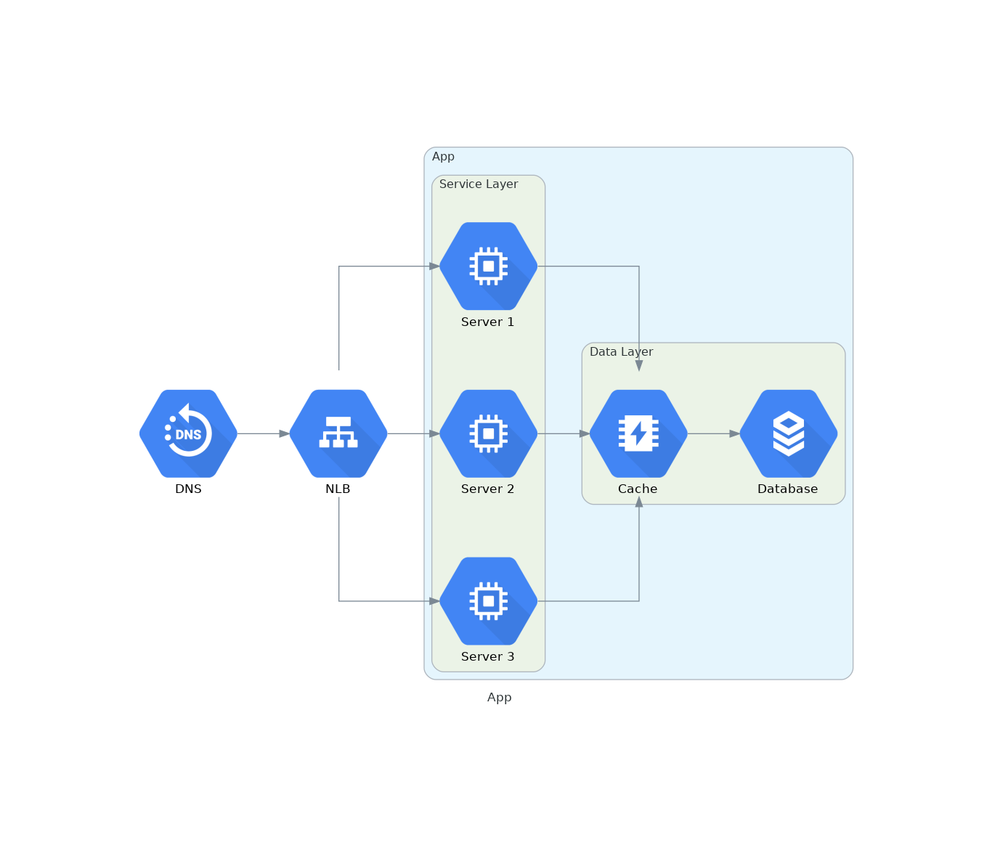

# Go-Diagrams

## Fast and easy application diagrams

Go-Diagrams is a loose port of [diagrams](https://github.com/mingrammer/diagrams).

### Features

Turn this:

```golang
d, err := diagram.New(diagram.Filename("app"), diagram.Label("App"), diagram.Direction("LR"))
if err != nil {
    log.Fatal(err)
}

dns := gcp.Network.Dns(diagram.NodeLabel("DNS"))
lb := gcp.Network.LoadBalancing(diagram.NodeLabel("NLB"))
cache := gcp.Database.Memorystore(diagram.NodeLabel("Cache"))
db := gcp.Database.Sql(diagram.NodeLabel("Database"))

dc := diagram.NewGroup("GCP")
dc.NewGroup("services").
    Label("Service Layer").
    Add(
        gcp.Compute.ComputeEngine(diagram.NodeLabel("Server 1")),
        gcp.Compute.ComputeEngine(diagram.NodeLabel("Server 2")),
        gcp.Compute.ComputeEngine(diagram.NodeLabel("Server 3")),
    ).
    ConnectAllFrom(dns.ID(), diagram.Forward()).
    ConnectAllTo(cache.ID(), diagram.Forward())

dc.NewGroup("data").Label("Data Layer").Add(cache, db).Connect(cache, db)

d.Connect(lb, dns, diagram.Forward()).Group(dc)

if err := d.Render(); err != nil {
    log.Fatal(err)
}
```

Into this:


